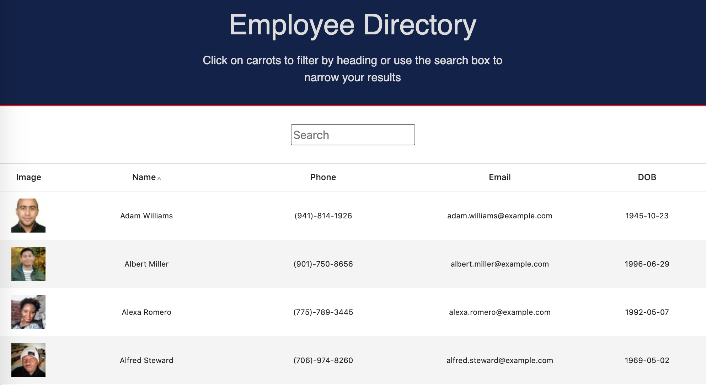

# Employee Directory Using React

Technologies: React, JavaScript

The Employee Directory App UI uses React components, manages component state and responds to user events such as searching for employee name and clicking the 'name' column to order by ascending/descending order.

## View Application:

* [Heroku Link: https://jenn-employee-directory-react.herokuapp.com/](https://jenn-employee-directory-react.herokuapp.com/)

## Details

* The user should be able to:
  * View a random list of employees on page load.
  * Sort the table by 'name'.
  * Filter the users by typing the characters they want to include in the name, using the 'search' field.
